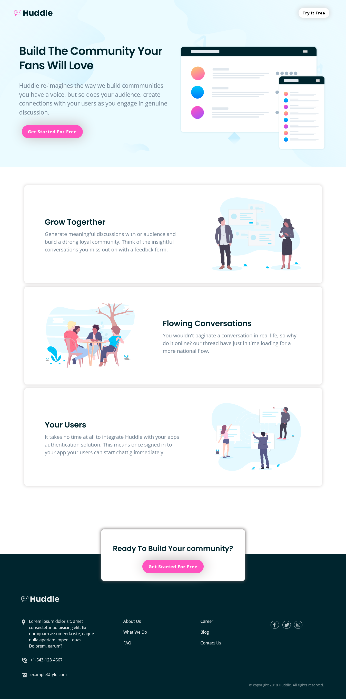

# Frontend Mentor - Huddle landing page with alternating feature blocks solution

This is a solution to the [Huddle landing page with alternating feature blocks challenge on Frontend Mentor](https://www.frontendmentor.io/challenges/huddle-landing-page-with-alternating-feature-blocks-5ca5f5981e82137ec91a5100). Frontend Mentor challenges help you improve your coding skills by building realistic projects.

## Table of contents

- [Overview](#overview)
  - [The challenge](#the-challenge)
  - [Screenshot](#screenshot)
  - [Links](#links)
- [My process](#my-process)
  - [Built with](#built-with)
  - [What I learned](#what-i-learned)
  - [Continued development](#continued-development)
- [Author](#author)

## Overview

### The challenge

Users should be able to:

- View the optimal layout for the site depending on their device's screen size
- See hover states for all interactive elements on the page

### Screenshot



### Links

- Solution URL: [https://github.com/netnaho/project__huddle.git](https://github.com/netnaho/project__huddle.git)
- Live Site URL: [https://netnaho.github.io/project__huddle/](https://netnaho.github.io/project__huddle/)

## My process

### Built with

- Semantic HTML5 markup
- CSS custom properties
- Flexbox
- CSS Grid
- Mobile-first workflow

### What I learned

In this project i have managed to apply many things that i have learned on the way about designing web pages using HTML and CSS. Also i gained some usefull skills on the way. Some of the things i used in this project are Semantic HTML CSS grids and flexbox. And to make the page responsive i used media queries and i also used the BEM convention. In this project i didn't used any frameworks only some css custom properties.

some of the code snippets are shown below:

```html
<section class="callout">
  <div class="callout__content">
    <h2 class="callout__header">Ready To Build Your community?</h2>
    <button class="btn btn--pink callout__btn" type="submit">
      Get Started For Free
    </button>
  </div>
</section>
```

```css
.hero__content {
  display: flex;
  flex-direction: column;
  align-items: center;
  text-align: center;
  margin: 20px;
  margin-bottom: 0;
}

@media screen and (min-width: 868px) {
  .card {
    flex-direction: row;
    justify-content: space-between;
    align-items: center;
    text-align: left;
    column-gap: 11rem;
    padding: 3rem 8rem;
  }
  .card:nth-of-type(odd) > .card__img {
    order: 2;
  }
}
```

### Continued development

Working on this project helped me to notice some of the skills i need to improve and what other types of technologies i need to learn. so after this i will improve my designing and layout. I will also try to improve my skills on making sites responsive. And I will try learning some frameworks as well.

## Author

- Frontend Mentor - [@netnaho](https://www.frontendmentor.io/profile/netnaho)
